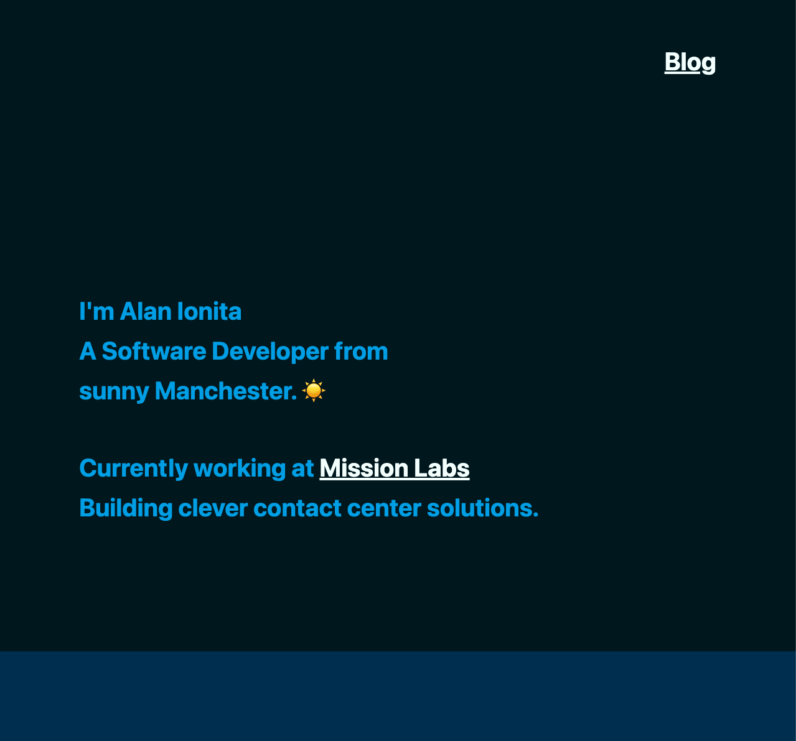

# Portfolio site



A porfolio site built with NextJS

<!-- ## User stories 

Audience: shoe shop employee would like to manage all the orders happening on the shop floor, with a connection to the store room.

```
As a shop assistant I can see a list of the order queue, so that I can see the orders as they are placed (latest first)
```

```
As a shop assistant I can filter the list by order status, so that I can check up orders as customers ask
```

```
As a shop assistant I can remove the filter, so that I can see the full list
```

```
As a shop shop manager I want the app to rotate panels, so that I reuse the app as a display for customers
```

```
As a shop shop manager I expect the app to feature an API, so that orders are securely stored in the cloud
```

```
As a shop shop manager I expect the app to feature an API, so that new orders can be created
```

```
As a shop shop manager I expect the app to feature an API, so that existing orders can be removed
``` -->

## Architecture and Rationale

NextJS app exported at as static bundle and served from Github Pages.

I've always wanted my portfolio site to be simple and fast so static files and free hosting on GH Pages was always the preferred option. I originally wrote the site in Gatsby, but shifted to NextJS as I learned more about it.

The site also uses Github Actions as a CI/CD pipeline with a small amount of work going into the caching of both the node_modules and the NextJS build cache. Current builds are under 1min, but I'm looking for ways to further simplify that.

### Design 

Having spent a long time working with designers I picked up a taste for good typography. I wanted this site to convey everything it needs through typography and negative space.

### Frontend

A fairly standard NextJS build. I didn't necessarily pick NextJS because it was new, but because it was familiar and straightforward. It's hard enough to work on personal projects with perfectionism getting in the way.

Typescript is implemented because it's another tool I found useful in work and I can't separate myself from it now. 

On the `css` I wanted to do something a bit crazy so I decided to not use `node-sass`. Sass is a great package, but most people use it for nested definitions - which is a great feature to have when writing media queries. 

I wanted to move away from it because I've always found it clunky, proper for errors, and I tend to think of it as an unnecessary waste of resources - especially when we're considering the build cost of another compiler.

Look you CANNOT go wrong with native tech. Ironically I didn't follow this decree with NextJS, but I wanted to use CSS Modules and CSS Variables for most of the styling system. If you want to see something cool, checkout how I did fluid typography with css variables.

### Data

Data is made up of two entities: segments and posts

Segments designate horizontal strips of the site. The Segment entity is stored as .json amd contains content and specific instructions for the segment: color, text orientation etc.

A page is made up of multiple segments in a classic single page fashion.

Posts are blog posts. The Post entity is stored as .md files with a frontmatter header. Frontmatter was new to me, but helps to add meta data to a posts which can later translate into date, title, url, and more.

The Post entities are ultimately parsed into HTML and injected into the page.

## Challenges and Lessons learned

- using CSS variables for responsive typography
- using frontmatter for metadata
- defining fast pipeline instructions

## Installation
-------------

With [npm](https://npmjs.org/) installed, run

```
$ npm i
```

## Developing
-------------

To run the app locally, execute ⬇️. If this is the first time running the app you may need to run the build script first.

```
npm run dev
```

This triggers the NextJS hot-reload server too so you'll be able to see changes in real-time

### Building

```
npm run build
```

To turn the files in local static files run

```
npm run export
```

## Acknowledgments
-------------
- [Harm Putman: blockquote style](https://codepen.io/harmputman/pen/IpAnb)


## See Also
-------------

## Author
-------------
Alan Ionita

## License
-------------
ISC